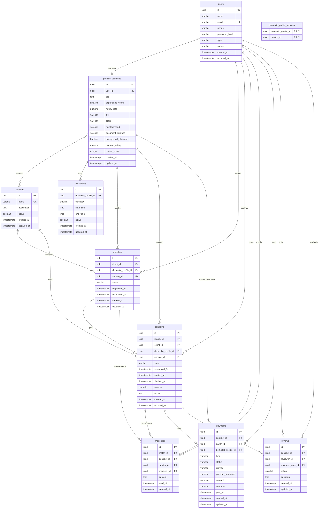

# Banco de dados

O banco principal usa PostgreSQL com migrations versionadas pelo Flyway.

## Migration inicial

- `src/main/resources/db/migration/V1__create_main_schema.sql`

## Entidades

- `users`: usuários da plataforma, separados por `CLIENT` e `DOMESTIC`.
- `profiles_domestic`: dados específicos da doméstica, vinculados 1:1 a um usuário.
- `services`: tipos de serviço oferecidos.
- `domestic_profile_services`: relação N:N entre domésticas e serviços.
- `availability`: agenda semanal de disponibilidade da doméstica.
- `matches`: solicitação e relacionamento inicial entre cliente e doméstica.
- `contracts`: contratação efetiva originada de um match aceito.
- `messages`: mensagens de chat ligadas a match ou contrato.
- `payments`: pagamentos de serviços e assinaturas.
- `reviews`: avaliações pós-serviço.

## Regras principais

- Todas as tabelas de negócio usam UUID como chave primária.
- Status e tipos são armazenados como `VARCHAR` com `CHECK` constraints.
- Campos monetários usam `NUMERIC(10, 2)`.
- Datas de auditoria usam `TIMESTAMPTZ`.
- `users.email` é único.
- Cada doméstica tem exatamente um `profiles_domestic`.
- Cada contrato nasce de um único match.
- Cada usuário pode avaliar um contrato apenas uma vez.

## ERD

